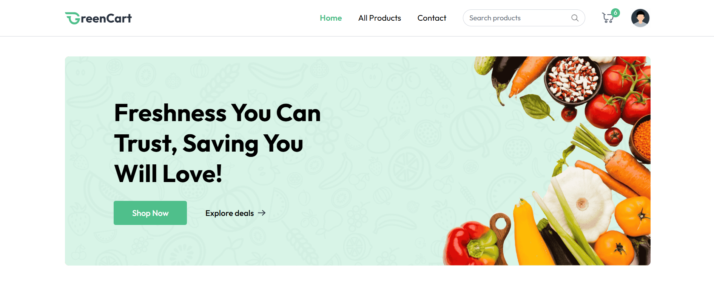
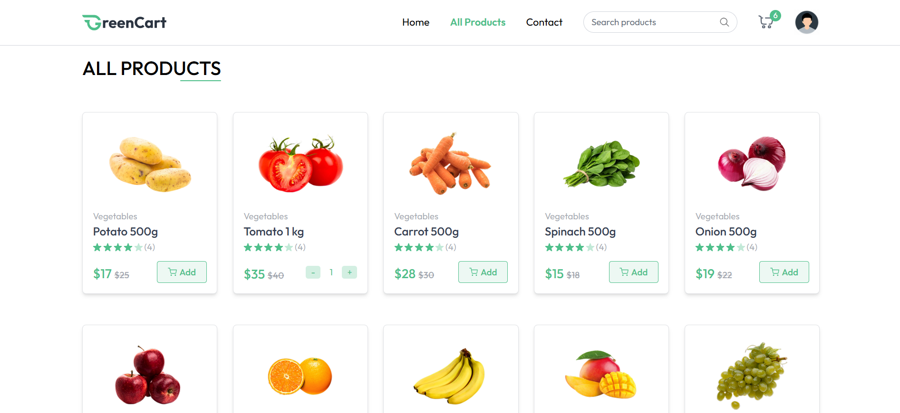
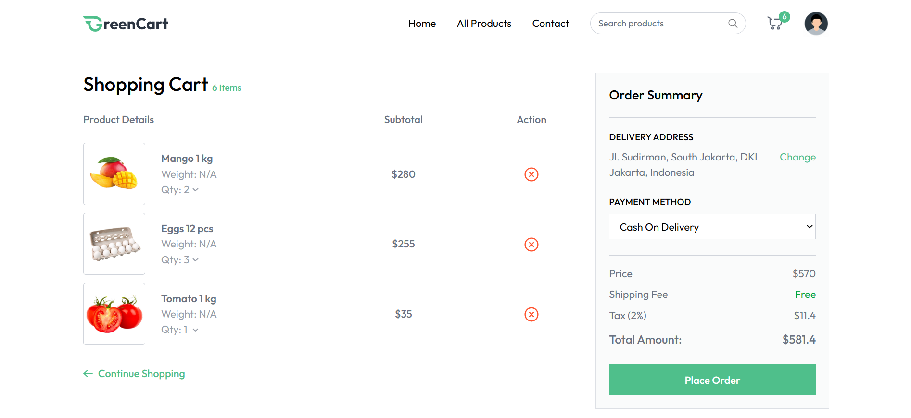
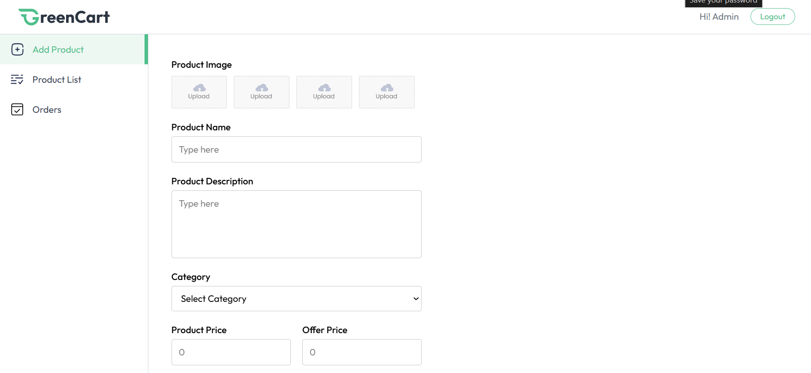
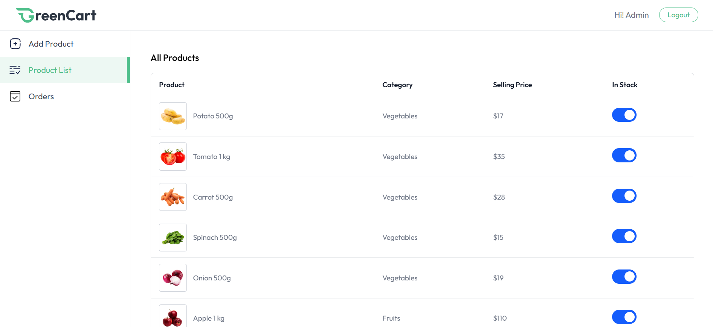
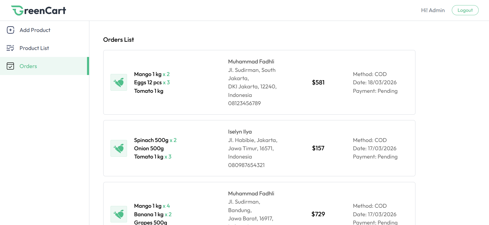

# 🛒 GreenStack E-Commerce App

An **E-Commerce Application** built on the **MERN Stack (MongoDB, Express, React, Node.js)** with two main user roles: **User and Seller (Admin)**.
This project allows users to browse products, manage their cart, and place orders, while sellers can manage products and orders.

---

## 🌐 Live Demo

🔗 https://mern-ecommerce-app-gamma.vercel.app

---

## 🚀 Features

### 👤 User Features

* User registration & login
* Browse products by category
* View product details
* Add products to cart
* Manage shipping addresses
* Checkout and place orders

### 🛍️ Seller (Admin) Features

* Seller authentication
* Add new products
* Manage product listings
* View and manage orders

---

## 🛠️ Tech Stack

### Frontend

* React (Vite)
* Context API (State Management)
* Axios
* React Router

### Backend

* Node.js
* Express.js
* MongoDB (Mongoose)

### Tools & Services

* Cloudinary (Image Upload)
* Multer (File Handling)
* JWT (Authentication)
* Vercel (Deployment)

---

## 📂 Project Structure

### Backend

```
backend/
├── configs/
├── controllers/
├── middlewares/
├── models/
├── routes/
└── server.js
```

### Frontend

```
frontend/
├── src/
│   ├── components/
│   ├── context/
│   ├── pages/
│   ├── App.jsx
│   └── main.jsx
```

---

## ⚙️ Installation & Setup

### 1️⃣ Clone Repository

```bash
git clone https://github.com/MFadhliAlHafizh/mern-ecommerce-app.git
cd mern-ecommerce-app
```

---

### 2️⃣ Backend Setup

```bash
cd backend
npm install
```

Create a `.env` file:

```env
PORT=4000
MONGODB_URL=your_mongodb_uri

JWT_SECRET=your_jwt_secret
NODE_ENV=development

# Admin Credentials
SELLER_EMAIL=your_admin_email
SELLER_PASSWORD=your_admin_password

# Cloudinary
CLOUDINARY_CLOUD_NAME=your_cloud_name
CLOUDINARY_API_KEY=your_api_key
CLOUDINARY_API_SECRET=your_api_secret
```

#### 📄 `.env.example` (Backend)

```env
PORT=4000
MONGODB_URL=

JWT_SECRET=
NODE_ENV=development

SELLER_EMAIL=
SELLER_PASSWORD=

CLOUDINARY_CLOUD_NAME=
CLOUDINARY_API_KEY=
CLOUDINARY_API_SECRET=
```

Run backend:

```bash
npm run server
```

---

### 3️⃣ Frontend Setup

```bash
cd frontend
npm install
```

Create a `.env` file:

```env
VITE_BACKEND_URL=http://localhost:4000
VITE_CURRENCY=$
```

#### 📄 `.env.example` (Frontend)

```env
VITE_BACKEND_URL=
VITE_CURRENCY=
```

Run frontend:

```bash
npm run dev
```

---

## 🔐 Environment Variables

Copy `.env.example` to `.env` and fill in your configuration:

```bash
cp .env.example .env
```

---

## 🔐 Authentication

* Uses **JWT (JSON Web Token)** for authentication
* Middleware:

  * `authSeller.js` → Protect seller routes
  * `userSeller.js` → Validate user/seller access

---

## 🧠 Core Functional Flow

### 🛒 Cart Flow

1. User adds product to cart
2. Data stored in backend
3. Displayed in cart page

### 📦 Order Flow

1. User proceeds to checkout
2. Order is created in database
3. Seller can view and manage orders

---

## 📄 Pages Overview

### User Pages





### Seller Pages




